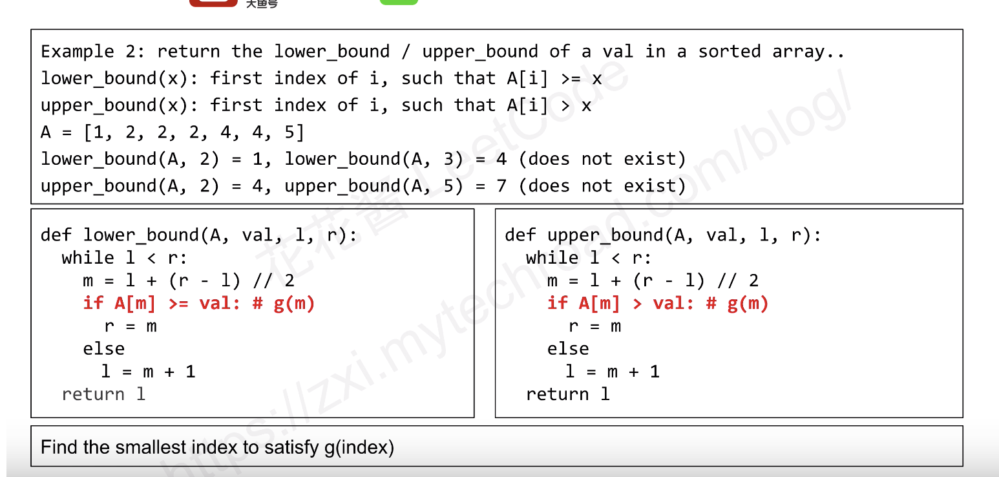

# Topic 1 Binary Search

This section is to discuss general strategies that I used to slove binary search problems in leetcode, and leetcode problem ID will be listed under this topic.

The general method for bianry search works as follows

### Summary

* Binary search typically sovles problems with sorted arrays and has O(logn) time complexity
