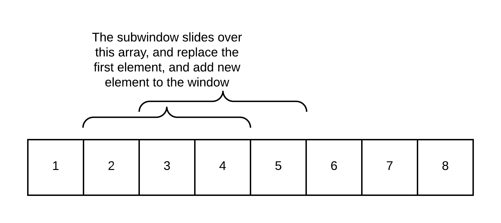

# Topic Sliding window technique

This section is intended to solve all related leetcode problems using sliding window technique.



### Leetcode 643. Maximum Average Subarray I

Given an array consisting of n integers, find the contiguous subarray of given length k that has the maximum average value. And you need to output the maximum average value.

Example 1:
```
Input: [1,12,-5,-6,50,3], k = 4
Output: 12.75
Explanation: Maximum average is (12-5-6+50)/4 = 51/4 = 12.75

Note:

1 <= k <= n <= 30,000.
Elements of the given array will be in the range [-10,000, 10,000].
```

### Solution 1
using sliding window to store all sums for the nums array, and then traverse over the sums array to get sum of k length of subarray by using `nums[i+k]-nums[i-1]`, which is pretty much like integral image technique used in eigenfaces in CV. However, this method has O(n) space complexity, and O(n) time complexity.

```cpp
class Solution {
public:
    double findMaxAverage(vector<int>& nums, int k) {
        int size=nums.size();
        int sums[size];
        int sum=0;
        //using sliding window menthod just like integral image in the computer vision
        for(int i=0;i<size;++i){
            sum+=nums[i];
            sums[i]=sum;
        }
        double max=sums[k-1];
        for(int i=1;i<=size-k;++i){
            double temp=sums[i+k-1]-sums[i-1];
            //cout<<"the temp : "<<temp<<endl;
            if(temp>max){
                max=temp;
            }
        }
        return max/k;
    }
};
```
### Solution 2
This method only traverses the nums array only once, and it also achieves time complexity of O(n), but with space complexity O(1) which is superier than sliding windown above, since it requires constant space to store the sums of subarrays. Sample code works as follows:

```cpp
class Solution {
public:
    double findMaxAverage(vector<int>& nums, int k) {
        int size=nums.size();
        double sum=0;
        for(int j=0;j<k;++j){
            sum+=nums[j];
        }
        double res=sum;
        for(int i=k;i<size;++i){
            sum+=nums[i]-nums[i-k];
            if(sum>res){
                res=sum;
            }
            //res=max(res, sum);
        }
        return res/k;
    }
};
```
### Leetcode 438. Find All Anagrams in a String
Given a string s and a non-empty string p, find all the start indices of p's anagrams in s.
Strings consists of lowercase English letters only and the length of both strings s and p will not be larger than 20,100.
The order of output does not matter.

Example 1:
```
Input:
s: "cbaebabacd" p: "abc"

Output:
[0, 6]
```

Use slide window approach combined with hash table
```cpp
class Solution {
public:
    vector<int> findAnagrams(string s, string p) {
        if(s.empty()) return {};
        int len_s=s.length();
        int len_p=p.length();
        if(len_p>len_s)
            return {};
        vector<int> res, count1(256, 0), count2(256,0);
        for(int j=0;j<len_p;++j){
            ++count1[s[j]];
            ++count2[p[j]];
        }
        if(count1==count2)
            res.push_back(0);
        //vector<int> temp;
        for(int i=len_p;i<len_s;++i){
            //temp=count;
            ++count1[s[i]];
            --count1[s[i-len_p]];
            if(count1==count2)
                res.push_back(i-len_p+1);
        }
        return res;
    }
};
```